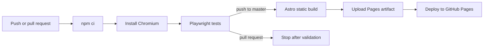

# Mrityunjay Kumar — Personal Site

[](https://github.com/mrityunjaykumar911/mrityunjaykumar911.github.io/actions/workflows/deploy.yml)

Personal portfolio and résumé site built with [Astro](https://astro.build), validated with Zod, tested in Chromium with [Playwright](https://playwright.dev), and deployed as a static site to GitHub Pages.

**Live site:** [mrityunjaykumar911.github.io](https://mrityunjaykumar911.github.io/)

## Why We Migrated

The previous site was generated from a Hugo résumé template, but the repository contained only its generated output. The Hugo source, content files, and effective configuration were absent. Updating the site therefore meant editing a 44 KB generated HTML file directly.

The generated site also had several problems:

- Content, layout, and presentation were tightly coupled in one HTML document.
- The résumé had become difficult to update and validate.
- Metadata for social previews and structured search results was incomplete.
- Analytics used a GA4 identifier with the retired Universal Analytics API.
- Font Awesome loaded a large third-party script for a small icon set.
- Broken and empty links could be published without a build failure.
- There was no automated browser testing or deployment gate.

Astro preserves the important constraint of a fully static GitHub Pages deployment while restoring a maintainable source project.

## Before and After

| Hugo template output | Astro project |
| --- | --- |
| Generated HTML edited by hand | Content stored in YAML |
| No source templates in the repository | Reusable Astro components |
| Content errors discovered after publishing | Zod schema failures during build |
| External fonts and icon scripts | Self-hosted fonts and inline SVG icons |
| Limited SEO and social metadata | Canonical, OpenGraph, Twitter, and JSON-LD metadata |
| No automated tests | Seven Playwright browser tests |
| Branch output deployed directly | Test-gated GitHub Actions deployment |

## Architecture

```text
src/
├── components/          Reusable page sections and shared résumé renderer
├── data/
│   ├── resume.yaml      Default published résumé
│   ├── resume.latest.yaml
│   │                    Public flag-gated detailed résumé
│   ├── resume.local.yaml
│   │                    Optional git-ignored development override
│   ├── resume.ts        Loading, validation, filtering, and overlay merge
│   └── schema.ts        Zod content schemas
├── layouts/Base.astro   Metadata, fonts, and document shell
├── lib/                 Preview, URL, and text helpers
├── pages/
│   ├── index.astro      Default route
│   ├── latest/          Prebuilt detailed route
│   └── 404.astro        GitHub Pages-compatible error page
└── styles/global.css    Design tokens and shared styles

public/                  Images, fonts, favicon, and résumé PDF
tests/e2e/               Playwright browser tests
```

The site uses no server at runtime. Astro produces static files in `dist/`, and GitHub Pages serves those files directly.

## Content Model

Most content changes belong in [`src/data/resume.yaml`](src/data/resume.yaml). The build validates this file against [`src/data/schema.ts`](src/data/schema.ts); malformed URLs, missing fields, invalid dates, and unknown top-level keys fail the build.

The inline prose renderer supports a deliberately small markup subset:

```text
*emphasis*  **strong**  `code`  [link](https://example.com)
```

### Detailed résumé flags

The normal URL displays the default résumé:

```text
https://mrityunjaykumar911.github.io/
```

These URLs display the detailed résumé while preserving the query string:

```text
https://mrityunjaykumar911.github.io/?flags=latest
https://mrityunjaykumar911.github.io/?preview
```

The detailed content comes from [`src/data/resume.latest.yaml`](src/data/resume.latest.yaml). It is included in the static deployment and is therefore **public and discoverable**. The flag controls presentation, not access.

For an uncommitted development override, create `src/data/resume.local.yaml`. It is git-ignored and takes precedence during `astro dev` only.

## Local Development

Requires Node.js 22.

```powershell
npm install
npm run dev
```

Open:

```text
http://localhost:4321/
http://localhost:4321/?flags=latest
http://localhost:4321/?preview
```

Create and validate a production build:

```powershell
npm run build
npm run preview
```

`npm run build` runs `astro check` before generating the static site.

## Playwright Tests

Install the Chromium test browser once:

```powershell
npx playwright install chromium
```

Run the complete suite:

```powershell
npm run test:e2e
```

Run with Playwright's interactive UI:

```powershell
npm run test:e2e:ui
```

The suite builds and serves the production site, then verifies:

1. The default page remains generic and includes complete metadata.
2. The normal URL never requests or renders the detailed résumé.
3. The console greeting and preview link appear, including after DevTools-style resizing.
4. `?flags=latest` loads the detailed résumé.
5. `?preview` loads the detailed résumé.
6. Mobile navigation works without horizontal overflow.
7. The portrait badge remains inside the photo and clear of its caption.

Playwright uses a visible list reporter locally. Astro build and preview output is piped to the terminal so startup progress is never silent. On failure, screenshots, traces, and an HTML report are generated; CI uploads the report as an artifact.

## CI and Deployment

[`.github/workflows/deploy.yml`](.github/workflows/deploy.yml) runs on pushes and pull requests targeting `master`.



A deployment cannot start unless the browser tests pass. Failed runs retain the Playwright HTML report for seven days.

GitHub Pages must be configured once under **Settings → Pages → Build and deployment → Source → GitHub Actions**.

## Configurable Deployment URL

The canonical origin and deployment base default to:

```text
https://mrityunjaykumar911.github.io
```

Override them with `SITE_URL` in a local `.env` or CI environment:

```env
SITE_URL=https://www3.cs.stonybrook.edu/~mrkumar/
```

The build derives the Astro base path from this URL, including metadata, sitemap entries, images, fonts, résumé links, and the detailed résumé route. This allows the same source to deploy at a domain root or under a path such as `/~mrkumar/`.

## Common Updates

Update published content:

```text
src/data/resume.yaml
```

Update public detailed content:

```text
src/data/resume.latest.yaml
```

Replace the résumé PDF while keeping its stable URL:

```text
public/cv/MrityunjayKumar-CV.pdf
```

Before pushing:

```powershell
npm run test:e2e
```
