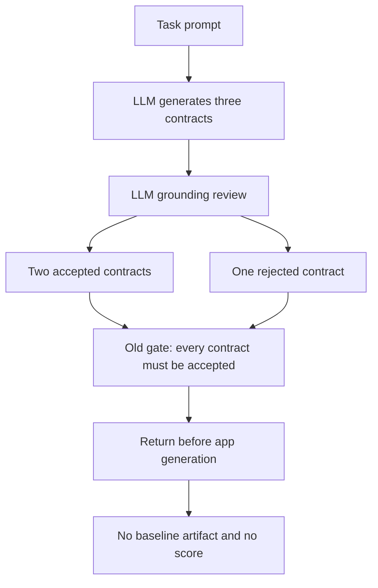
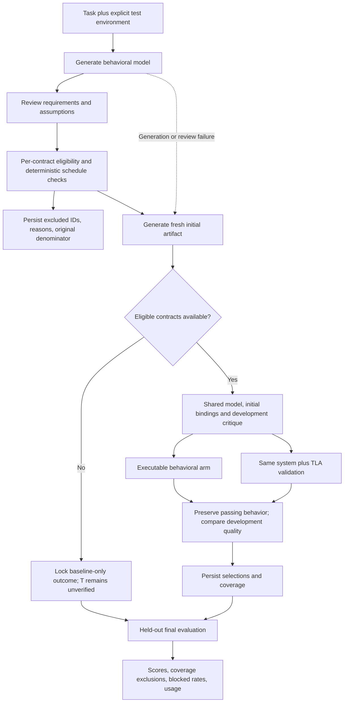
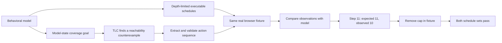
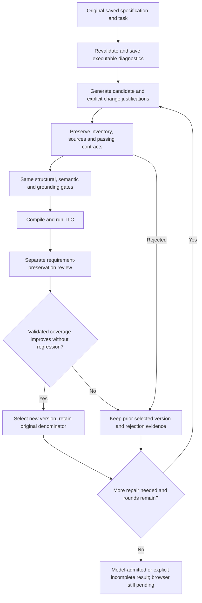

# Study C Optimization Report

Date: 2026-09-09
Current offline harness protocol: `quality-evidence-v7`; the paid run remains `quality-evidence-v6`
Current compiler: `semantic-evidence-v1`
Status: scored v6 task-1267 run completed; fresh initial artifact scored 58/100, T blocked with no score; no quality-score gain established.

Portable closure summary: [study-c-closure.json](figures/study-c-closure.json). Detailed `.tools` links below refer to git-ignored local evidence retained on the study machine; they are provenance references, not files distributed with the repository.

## Executive Summary

The failed 1097 experiment was stopped by an all-or-nothing LLM grounding-review gate, not by a counterexample in an application. Two contracts were accepted; a third modeled a page as initially unopened even though the browser loads it before the first observation. The reviewer also incorrectly challenged the supplied viewport and clock as though they were product requirements.

The correction is architectural, with prompt clarification as a supporting change:

- Keep task contracts generative. The executor, expression language, compiler, and validation rules are fixed infrastructure, not a fixed task-contract catalog.
- Admit contracts individually. Preserve every exclusion and the original contract denominator.
- Continue generating and rating the initial artifact if all contracts are rejected or model generation fails. Do not assign that rating to a blocked T arm.
- Allow eligible contracts to exercise both comparison arms, while labeling partial coverage as incomplete overall.
- Supply one explicit execution environment to generation, grounding, binding, and mapping review.
- Demonstrate a separate TLC-to-browser reachability-witness mechanism offline before enabling it in a paid comparison.

This removes the whole-trial veto. It does **not** eliminate the difficulty of deriving correct semantics from natural-language requirements, and it does not prove TLA+ improves benchmark scores.

## Observed Failure

Source: [saved v2 run summary](../.tools/study-c/quality-runs/quality-v2-1097-first/summary.json).

| Measurement | Observed value |
| --- | --- |
| Task | 1097, mobile ping-pong score counter |
| Run | `quality-v2-1097-first` |
| Elapsed time | About 355.8 seconds |
| xAI calls / retries | 2 / 0 |
| Input / output / total tokens | 5,894 / 20,229 / 26,123 |
| Accepted contracts | `two_side_point_counting`, `sides_stay_independent` |
| Rejected contract | `html_mobile_runtime` |
| App generation / final scoring | Neither occurred |
| Outcome | `grounding_rejected`, incomplete run |

The generated mobile contract used `pageOpen = 0`, an explicit open action, and score counters to represent mobile execution. Opening the page was already a harness operation, so the model's initial state did not match the observable browser state. A visible container or a `pageOpen` bit also does not establish mobile usability.



## Root Causes and Corrections

| Root cause | Consequence | Correction / remaining limitation |
| --- | --- | --- |
| Whole-model reviewer veto | One rejection discards useful work | Per-contract eligibility with recorded exclusions |
| Environment not explicitly included in the grounding payload | Reviewer disputes valid test conditions | Same environment object supplied throughout the generation/review path |
| App creation depends on formal eligibility | No useful baseline if formal preparation fails | Initial artifact and held-out baseline rating still run |
| Accepted contracts mistaken for complete coverage | Selective success can hide missing obligations | Generated, eligible, and excluded inventories remain in summaries and selection records |
| Syntax-valid model mistaken for correct requirements | Formal tools can verify an incorrect interpretation | Keep fallible grounding/mapping reviews and executed checks; no semantic-proof claim |
| T mainly validates schedules already used by the baseline | Little additional defect-finding signal | Implement and test a TLC reachability-witness experiment separately |

Previously implemented fixes remain relevant: isolated JVM temporary directories, explicit infrastructure-error classification, real touch actions, a tested TLA compiler, and preservation checks before selecting a repair. A Java validator crash is not an application concurrency violation.

## Implemented Execution Policy

`eligibleQualityRecord` creates an execution view without rewriting the original generated model or its review. Deterministically unexecutable schedules are excluded as well as reviewer-rejected contracts. The same eligible subset is presented to both comparison arms.

| Case | Baseline | Optimization arms | Coverage/reporting |
| --- | --- | --- | --- |
| All contracts eligible | Generate and rate | Execute normal evidence-guided selection | Can be complete if all subsequent stages succeed |
| Some contracts excluded | Generate and rate | Execute eligible subset only | `partial-contract-coverage`; overall incomplete; exclusions retained |
| No eligible contracts | Generate and rate | No unsupported optimization | `baseline-only`; both arm scores null; blocked-arm rate 1 |
| Model generation/review unavailable | Generate and rate | No fixed-contract fallback | Baseline-only; generated denominator unknown, not fabricated as zero |
| DOM binding/review fails | Baseline retained | Affected evidence remains blocked | Never turn a missing mapping into a pass or application defect |

These policies do not bypass the behavioral evidence gate for selecting candidates. Incomplete **executed evidence within the eligible scope** still prevents a candidate from being promoted. An eligible subset is not a claim that all task requirements have been covered.



### Environment Contract

- Clock: `2030-01-01T12:00:00Z`; timezone: UTC.
- Viewport: 390 by 844 pixels.
- Storage: empty at browser-context creation.
- First observation: the page is already loaded and setup has completed.
- Empty storage does not imply no seeded application content.
- These are test conditions, not new product obligations.

## Offline Reachability Experiment

Implementation: [coverage-witness.mjs](../scripts/study-c/pipeline/coverage-witness.mjs).
Executable experiment: [coverage-witness.test.mjs](../scripts/study-c/pipeline/coverage-witness.test.mjs).

The experiment uses a small synthetic counter with Add and Reset actions. The behavioral model permits increments beyond its exploration boundary. A defective browser fixture silently stops incrementing at 10. The repaired fixture removes that cap. These are regression fixtures, not production task contracts or an ArtifactsBench result.

TLC is given an intentionally negated coverage goal, `CoverageTargetNotReached`. A violation means the requested model state is reachable. The resulting sequence is checked against the shared interpreter and then executed in the browser. Only an actual browser/reference mismatch is an artifact failure.



| Measurement | Depth-limited baseline | TLC witness |
| --- | --- | --- |
| Traces | 8 | 1 |
| Browser actions | 43 | 12 |
| Depth / target | Maximum depth 8 | Reach count 12 |
| Defect detected | No | Yes, at step 11 |
| Repaired fixture | Pass | Pass |

**Interpretation:** this is a working witness-to-browser defect-discovery mechanism. It is not evidence of a unique advantage of TLA+: a deeper non-formal graph search could discover the same path. The fixture was deliberately constructed around a depth gap. JVM/model-checking cost is additional and was not equated with baseline compute. No statistical or leaderboard improvement follows from this result.

**Integration boundary:** reachability witnesses are currently an offline experiment, not automatically added to the paid `run-quality` comparison. Enabling them changes the trace-selection treatment and requires an explicit schedule/compute policy. The live v3 comparison still uses the shared model-derived schedules with optional TLC validation.

## Verification

All commands ran through VS Code tasks. No new xAI requests were made during this optimization work.

| VS Code task | Result |
| --- | --- |
| `Study C: quality framework tests` | 24 passed, 0 failed, 0 skipped in this workspace |
| `Study C: offline coverage witness experiment` | 2 passed, 0 failed |

The tests include:

- Replaying the real archived 1097 review through the new eligibility function: two retained contracts, one recorded exclusion, archived bytes unchanged.
- Total rejection and model-generation failure still producing a baseline rating, with no T score.
- Partial acceptance feeding the same eligible IDs to both arms while preserving the original denominator.
- Generator and reviewer receiving the same environment and no evaluator score.
- Actual browser touch events, interpreter/TLC agreement, and observation corruption at multiple steps.
- Candidate selection preceding held-out evaluation, rejection of behavior regressions, and one rating for identical artifacts.
- Actual TLC reachability output, real browser reproduction of the synthetic cap defect, and passing repaired fixtures.

The archived-review test skips if that local ignored artifact is absent in another checkout. The synthetic regression tests do not depend on the old paid response.

## Files and Operating Instructions

| File | Role |
| --- | --- |
| [quality-contracts.mjs](../scripts/study-c/pipeline/quality-contracts.mjs) | Shared environment, per-contract eligibility, generation/review provenance |
| [quality-trial.mjs](../scripts/study-c/pipeline/quality-trial.mjs) | Baseline continuity, partial-coverage reporting, locked selections |
| [coverage-witness.mjs](../scripts/study-c/pipeline/coverage-witness.mjs) | Offline reachability-goal compilation and witness extraction |
| [experiment.plan.json](../scripts/study-c/experiment.plan.json) | Versioned optimization policy and limitations |
| [tasks.json](../.vscode/tasks.json) | Test tasks and separate paid v3 opt-in task |

The configured `Study C: quality v3 task 1097 (paid opt-in)` task uses a separate `quality-v3-1097-first` run ID. It has not been launched as part of this change. Do not run the historical v2 task expecting its cached result to become a v3 result; the changed protocol intentionally changes trial identity.

### Required Reporting for Future Runs

1. Report initial quality even when formal preparation fails; never relabel it as a T success.
2. Report both task-level blocked-arm rate and per-contract exclusions. Zero blocked arms under a partial subset does not mean full formal coverage.
3. Preserve the original contract inventory and rejection reasons; do not compare only surviving favorable cases.
4. Keep development critics and final evaluation separate. A development score increase is not a benchmark increase.
5. Record actual API usage, retries, JVM time, browser actions, and unchanged-artifact score reuse. Equal API ceilings are not equal total compute.
6. Treat repeated changes to this five-task development set as exploratory optimization, not held-out confirmation.

## Next Evidence Gates

Before another efficacy claim:

- Predeclare a witness-selection policy and compare it against stronger non-formal searches with matched action and compute budgets, not only a shallow baseline.
- Confirm task-level semantic and mapping precision against independently inspected defects and valid negative cases.
- Measure validity yield, false-positive rate, detection yield, regression rate, final score delta, cost, and blocked coverage together.
- Extend testing across held-out tasks/categories; the current five samples are all `Utility Tools-Daily Office Tasks`.
- For leaderboard comparisons, align with the published evaluation conditions. The current xAI judge is not the leaderboard's Gemini judge.

The generator and reviewer remain fallible sources of candidate semantics. The implemented improvement limits their ability to cancel the whole trial and makes missing evidence explicit. It does not solve natural-language specification inference, provide complete HTML verification, or establish a higher ArtifactsBench score.

## Task 1267: Explicit Scenario Completion

The later paid run `quality-v3-1267-T-1gb-first` reached actual TLC checks using a 1 GB JVM heap. The generated `category_management` and `date_setting` models reached states where every modeled action was disabled. The compiler had no way to distinguish an intentionally finished finite scenario from an unintended stuck state. TLC correctly reported deadlock; the validator incorrectly summarized that specific result as `tlc_inconclusive`.

This was a model-language/compiler design omission, not evidence of a browser deadlock or a memory failure. The category scenario stopped after creating the category and item and assigning the category. The date scenario stopped after creating the item, setting its date, and editing that date. The archived generated models never explicitly declared those endpoints successful.

### Corrected Semantics

- A generated contract may declare `completion: { when, requirementId, reason }`. The predicate must be boolean, tied to an existing requirement, and justified as the endpoint of the finite test scenario, not termination of the application.
- Grounding review now explicitly checks completion for unsupported or premature success conditions. There is no task-ID fallback and no inference that all disabled actions automatically mean success.
- Exploration permits stuttering only when completion is declared true and every modeled action is disabled. `CompletionConsistent` rejects completion while an action remains enabled. Domain and observation invariants remain checked.
- An impossible action remaining in a replay still produces deadlock. Exhausting a supplied replay is distinct from claiming that the application has finished.
- The scheduler records completed states and undeclared dead ends. Discovered undeclared dead ends are excluded before paid DOM binding, with the original denominator and reason `undeclared_model_dead_end` retained. Search frontiers are not completion or deadlock; bounded admission is not exhaustive validation.
- The validator reports actual TLC deadlocks as `model_deadlock`, with `artifactFailure: false` and a diagnostic log path. They block evidence rather than become repair advice against the HTML.
- Model provenance, trial cache identity, and locked selections record `explicit-completion-v1`. Old completed-trial caches are rejected under the new compiler semantics.

Deadlock checking is not globally disabled. Completion declarations remain fallible generated semantics subject to review; these changes do not establish general liveness or complete application correctness.

### Archived Regression Evidence

The regression reads the archived model and tests copies only. The completion annotations below are diagnostic test inputs, not retroactive changes to the generated contracts or benchmark treatment.

| Archived contract | Unchanged model | Explicit completion on diagnostic copy | TLC result for copy |
| --- | --- | --- | --- |
| `category_management` | `model_deadlock` | `catExists = 1`, `todoExists = 1`, `todoTagged = 1` | Checked, 5 distinct states |
| `date_setting` | `model_deadlock` | `dateTodo = 1`, `dueDay = 3` | Checked, 4 distinct states |

The test asserts the archived file bytes remain unchanged. Required synthetic tests separately confirm that undeclared deadlocks, impossible replay actions, incorrect completion, observation mismatches, and safety violations still fail.

| VS Code task | Latest completion-fix verification |
| --- | --- |
| `Study C: model completion tests` | 4 passed, 0 failed, 0 skipped; includes actual TLC on archived copies |
| `Study C: quality framework tests` | 26 passed before the final early-admission/cache test additions |
| `Study C: completion eligibility and cache tests` | 15 passed after those additions; overlaps the framework suite |
| `Study C: offline coverage witness experiment` | 2 passed with the changed compiler; real browser defect reproduction preserved |

No additional xAI requests were made for this correction. The old run remains blocked: DOM mapping-review problems are separate, and annotated model copies do not establish a T score. The serial orchestration that delayed TLC until after bindings and critique also remains a separate limitation; this correction only moves deterministically discovered dead-end rejection into early admission.

Implementation and regression: [behavioral-model.mjs](../scripts/study-c/pipeline/behavioral-model.mjs), [tla-oracle.mjs](../scripts/study-c/pipeline/tla-oracle.mjs), and [model-completion.test.mjs](../scripts/study-c/pipeline/model-completion.test.mjs).

## Fresh Validation of Both Claims

Run: `completion-1267-fresh-v1`, 2026-09-08. The user authorized this separate validation after the compiler correction. This is a new generated-model sample and a saved-artifact browser experiment, not a new benchmark score or a replacement for the historical blocked T run.

**Result: the compiler behavior is supported; correct fresh semantic generation is only partially supported.** All four freshly generated completion predicates terminate under TLC without manual model edits. Only one contract passed grounding. Its real browser control, defect mutation, and restoration checks succeeded. Excluding the other three does not establish full task coverage.

### Compiler and Model Results

The current `Study C: model completion tests` task passed 4/4 tests, with no skips, in 86.15 seconds. Its durable output is [completion-compiler-tests.tap](../.tools/study-c/completion-compiler-tests.tap). Negative cases still reject undeclared deadlocks, impossible replay actions, premature completion, safety violations, and incorrect snapshots.

The fresh generation started at 20:31:22 UTC, PID 35480. Generation and grounding used exactly two xAI calls. All model checks preceded binding; no app generation, development critique, or final evaluator was invoked.

| Fresh generated contract | Declared completed states | Actual TLC distinct states | Grounding / semantic result |
| --- | --- | --- | --- |
| `record_todos` | 1 | 3 | Admitted; create then reload. Persistence is a stronger interpretation of recording, not explicit prompt wording. |
| `category_mgmt` | 1 | 3 | Rejected; assumes Work absent, but saved app seeds Work and has no category-delete UI. |
| `date_setting` | 1 | 5 | Rejected; permits reload before edit while claiming edited-date persistence was checked. |
| `auto_reminders` | 1 | 3 | Rejected; imposes exact due-time/in-page behavior without specifying the app's reminder offset. |

All schedules reported zero undeclared dead ends and zero frontiers in their small generated abstractions. This is not exhaustive HTML coverage.

The initial model check for `record_todos` timed out during the 15-second Java discovery probe. An explicit offline recheck attempt then exposed a relative Java-path mistake in the new wrapper, which was corrected and regression-tested. Both failed attempts remain saved. The subsequent separate `offline-recheck-v2` checked all four unchanged models in 25.89 seconds using the absolute bundled Java path and a 1 GB heap. No API calls were made by either recheck, and no timeout was relaxed.

There is an executable semantic counterexample in the date model:

```text
create_pay_rent -> reload_pay_rent -> edit_pay_rent_date -> completion = true
```

The model therefore cannot justify its claim that reload checked persistence of the edited date on every completed path. TLC correctly verifies the supplied predicate; it cannot establish that the generated natural-language reason is true. The saved-model regression confirms this path and leaves the generated bytes unchanged. Some grounding-review statements are themselves debatable; the source inspection records concrete conflicts separately rather than treating reviewer rejection as proof.

### Browser Sensitivity

The browser phase ran from 20:49:02 to 20:56:47 UTC, PID 29772. It generated and reviewed one binding for the admitted `record_todos` contract using the original HTML. That binding and the unmodified generated model were reused across all three executions:

| Artifact | Real browser / TLC result |
| --- | --- |
| Original saved HTML | Pass; Buy milk remains present after create and reload |
| Diagnostic copy that persists an empty task list | Fail at step 2, after reload: `buy_milk_visible`, expected 1, observed 0; TLC `SnapshotMatches` violation at step 2 |
| Original HTML restored in a fresh context | Pass again with the same binding and actions |

The mutation changes only the persisted task list; in-memory creation and rendering still run. This is a real source-level persistence defect, not corrupted observations or a mocked TLC result. The generated binding uses a text-containing selector; its demonstrated sensitivity is for this unique-text fixture, not arbitrary title collisions.

Category-assignment and date-save mutations remain explicitly `blocked_control_not_passing`; they were not executed after their contracts failed grounding. The generated source and original saved HTML passed byte-integrity checks. The overall browser gate remains `incomplete`, with coverage **1/4**, despite the successful recording mutation check.

### Evidence and Cost

- [Fresh generated model and grounding](../.tools/study-c/completion-validation/completion-1267-fresh-v1/task-1267/shared-model/model.json)
- [Original preflight, including Java discovery failure](../.tools/study-c/completion-validation/completion-1267-fresh-v1/task-1267/model-preflight.json)
- [Offline all-model TLC recheck](../.tools/study-c/completion-validation/completion-1267-fresh-v1/task-1267/offline-recheck-v2/model-preflight.json)
- [Semantic inspection and counterexample](../.tools/study-c/completion-validation/completion-1267-fresh-v1/task-1267/semantic-inspection.json)
- [Browser control, mutation, and restoration report](../.tools/study-c/completion-validation/completion-1267-fresh-v1/task-1267/browser-v1/browser-report.json)
- [Input integrity](../.tools/study-c/completion-validation/completion-1267-fresh-v1/task-1267/browser-v1/source-integrity.json)

| Phase | Actual requests | Retries | Input tokens | Output tokens | Total tokens |
| --- | --- | --- | --- | --- | --- |
| Fresh generation and grounding | 2 | 0 | 7,263 | 26,851 | 34,114 |
| Binding and mapping review | 2 | 0 | 24,392 | 17,616 | 42,008 |
| Total | 4 | 0 | 31,655 | 44,467 | 76,122 |

These are provider-reported usage values, not the wrapper's requested-output reservations; actual reported output exceeded the requested reservations. No currency cost is inferred. The seven focused preflight/browser tests passed with no skips locally; the archived fresh-model test is optional when its ignored local artifact is absent. All commands used VS Code tasks.

The next unresolved requirement is semantic precision, particularly scenario ordering, achievable initial conditions, and separating chosen test configurations from mandatory product behavior. This validation does not authorize silently editing the generated model, overriding rejected reviews, or rerolling samples until they pass. It provides one successful compiler-to-browser defect check and concrete evidence that the broader generation problem remains unsolved.

## Ordered Semantic Preflight Implementation

The next user-authorized change was implemented in the requested order, with offline validation before a single fresh generation preflight. No historical generated contract was edited or silently upgraded. The current quality protocol is `quality-evidence-v4`; the compiler version is `semantic-evidence-v1`, so previous trial identities cannot be reused as current evidence.

### 1. Requirements and Scenario Choices

[semantic-contract.mjs](../scripts/study-c/pipeline/semantic-contract.mjs) validates a generated `semantics` declaration with four separate inventories: scenario choices, ambiguities, prerequisites, and evidence rules. Requirements retain their prompt quotation and additionally declare an entailment basis and `evidenceMode` (`state` or `latest-after-action`). Scenario choices cannot be referenced as requirements. Unresolved ambiguities block admission even when the fallible grounding reviewer accepts the contract.

Names, dates, configured offsets, and delivery channels are test choices, not universal product obligations. Fresh-name choices require absence checks; setting and channel choices require explicit prerequisites. A temporal requirement must reference a matching evidence rule. This does not automatically detect a temporal requirement falsely labeled as a state requirement; semantic review remains necessary.

New authoring records preserve per-contract structural and semantic verdicts alongside the original model and grounding review. A structurally invalid contract is retained as a rejection instead of causing the entire valid inventory to disappear. Unreadable JSON or an invalid top-level inventory can still stop authoring, with the raw response retained.

### 2. Evidence-Based Completion

A generic evidence rule declares which actions invalidate it, which later action establishes it, and which actual observables support it. The compiler owns a finite freshness bit for each rule; the generator cannot assign that bit directly or use it as a fake DOM observation. Interpreter, scheduler, and TLA compilation share these semantics.

For the synthetic latest-value persistence requirement:

```text
Create -> Reload -> Edit: evidence stale, completion false
Create -> Reload -> Edit -> Reload: evidence fresh, completion may be true
```

Completion requires both its declared predicate and all evidence fresh. The scheduler includes evidence bits in state identity, preserving the distinction between equal values with different observation histories. Early-reload prefixes remain executable; not every transition-covering trace must end in completion. Trace reports distinguish observation agreement from `completionSatisfied`. A temporal contract cannot be reported successful when no executed trace establishes its completion evidence.

Freshness records action ordering, not browser truth. A post-reload stale visible value still fails the interpreter comparison and TLC `SnapshotMatches`. The observed values must match before a trace can claim completion.

### 3. Browser Prerequisites

[browser-prerequisites.mjs](../scripts/study-c/pipeline/browser-prerequisites.mjs) resolves prerequisites through data-only generated bindings:

- Exact-name collisions are checked against mapped label elements before setup and after setup. A conflict blocks with `scenario_name_conflict`; the executor does not delete or rename seeded data.
- Each configured setting must have an explicit fill/select operation in its declared action. Unsupported or unavailable controls/options block; the executor reads back the selected value. Defaults do not satisfy this requirement.
- Delivery-channel mappings must agree with the chosen supported in-page or instrumented-notification channel. A mapping is labeled `bound_not_yet_observed`, not proof of support or delivery. The actual message observation remains part of browser execution. Closed-app notifications are not claimed.
- Missing mappings and unsupported prerequisites retain specific reasons and prerequisite IDs in browser and evidence reports.

Selector completeness and whether a setting is applied before the relevant save remain mapping-review responsibilities. Runtime checks cannot prove that a generated selector includes every relevant item or that a generated evidence rule names every real mutation. A fresh diagnostic name is still checked for collisions rather than assumed unique.

### 4. Offline Gates Before Generation

All commands used VS Code tasks. Before the new xAI run:

| Task | Result |
| --- | --- |
| `Study C: semantic preflight tests` | 10 passed, no failures or skips in this workspace |
| `Study C: evidence completion tests` | 3 passed after adding explicit completion-evidence reporting; overlaps the semantic suite |
| `Study C: quality framework tests` | 28 passed, no failures or skips |
| `Study C: completion preflight tests` | 7 passed, no failures or skips |

The offline negative controls include the archived generated date model and the archived app that seeds Work. A diagnostic copy of the old date model with evidence tracking cannot complete after `create -> reload -> edit`; because its one-time reload guard cannot establish fresh evidence, it remains a real TLC deadlock rather than receiving an invented pass. A separate corrected synthetic model permits another reload and passes actual TLC. The archived files are checked byte-for-byte unchanged.

Real browser tests also demonstrate: seeded-name conflict blocks before setup; a fresh-name scenario executes; an explicit supported reminder setting produces an observed message; an unsupported setting blocks; default-only settings and unsupported delivery channels fail validation.

### Single Fresh Generation

The executed run was `semantic-1267-fresh-v1`, task 1267 only, from 21:27:34 to 21:37:21 UTC (586.6 seconds), PID 24700. It used one generation call and one grounding-review call, then local model checks. No HTML generation, binding, critique, score request, or second sample followed.

| Contract | Structural validation | TLC distinct states | Grounding review | Semantic admission |
| --- | --- | --- | --- | --- |
| `record_todo` | Pass | 2 | Accepted | Blocked: listed ambiguities |
| `category_mgmt` | Pass | 3 | Rejected | Blocked: listed ambiguities |
| `date_setting` | Pass | 2 | Rejected | Blocked: listed ambiguities |
| `auto_reminder` | Pass | 3 | Rejected | Blocked: listed ambiguities |

All four bounded models terminated without deadlock. Eligibility is **0/4**, not a success on a reduced subset. Both reviewer and deterministic verdicts remain saved. The process reported `modelGate=incomplete` and `browserGate=not-run`.

Fresh diagnostic names replaced the earlier assumption that seeded Work must be absent. The generator also stopped asserting edit/reload persistence for date setting. However, it emitted no `latest-after-action` requirements or evidence rules, so this fresh sample does **not** validate the generator's use of the new temporal mechanism. That mechanism is supported by the offline synthetic and archived negative tests only.

The run exposes remaining issues rather than proving reliable specification generation:

- Every contract listed ambiguities. Some are genuine unresolved dependencies, while others merely record out-of-scope features or facts already handled by prerequisites. The current conservative gate blocks both; it cannot distinguish a non-goal from an unresolved obligation dependency. This is a utility limitation of the current schema/gate, not evidence that every listed ambiguity invalidates the contract.
- The date observable still requires literal ISO-formatted text despite unspecified date display formatting.
- The reminder contract still assumes an exact trigger and in-page channel, with no explicit offset configuration. Its channel value is prose rather than a supported runtime token. It would remain unmappable, not become a pass.
- Several setting values are descriptions rather than directly applicable input/option values. Runtime configuration support was not exercised on this fresh sample.
- Evidence annotations, requirement evidence modes, selectors, and grounding judgments remain fallible. Structural validity and TLC success cannot establish their semantic truth.

Actual provider usage was **2 requests, 0 retries, 8,737 input tokens, 30,034 output tokens, 38,771 total tokens**. These are reported usage values, not the requested-output reservations or a currency estimate. No rejected model was manually edited or regenerated.

Evidence: [generated model and reviews](../.tools/study-c/completion-validation/semantic-1267-fresh-v1/task-1267/shared-model/model.json), [complete preflight and original denominator](../.tools/study-c/completion-validation/semantic-1267-fresh-v1/task-1267/model-preflight.json), [semantic inspection](../.tools/study-c/completion-validation/semantic-1267-fresh-v1/task-1267/semantic-inspection.json), and [usage](../.tools/study-c/completion-validation/semantic-1267-fresh-v1/task-1267/usage.json).

After this run, `Study C: semantic admission tests` passed 5/5, including a regression preserving all four fresh exclusions and the source bytes. The legacy real-TLC completion suite also passed 4/4 against the new compiler, preserving deadlock, safety, and replay negative cases. These test counts overlap the earlier suites and should not be summed as independent evidence.

The requested ordered implementation and single preflight are complete. Before further paid sampling, a separate change should distinguish unresolved dependencies from explicit non-goals, and make scenario settings directly executable. That is not a reason to retroactively weaken this run's gate or override its saved rejections.

## Bounded Generative Specification Repair

The user subsequently requested implementation of the missing generative repair loop. It is now implemented in [specification-repair.mjs](../scripts/study-c/pipeline/specification-repair.mjs), with the saved-source command [run-specification-repair.mjs](../scripts/study-c/run-specification-repair.mjs). This extends the earlier diagnostic-only workflow; it does not rewrite the historical 0/4 result.

The repair operation is generated by the model from the task, original specification, current selected specification, and executable feedback. There is no task-ID contract catalog, ambiguity-to-patch table, or hand-authored production repair. Fixed components are the schema, validators, budgets, and selection rules. The interaction follows an action/observation/revision pattern; it is not evidence that a particular agent-paper method guarantees correctness.



### Loop Policy

- Default: two rounds, at most three calls per round (candidate generation, ordinary grounding review, preservation review). The CLI allows zero through three rounds. Zero performs local validation only. The default requested-output reservation is 40,000 tokens across at most six calls; actual provider usage must be reported separately.
- Each prompt receives structural/semantic exclusions, grounding reasons, derived schedules/frontiers, validator status and counterexamples. Bounded excerpts of generated TLA/config and SANY/TLC logs accompany the feedback; truncation is recorded. Rejected candidate decisions and validation feedback are available to the next attempt.
- Candidates contain a complete generated model and per-contract explanations. Each previously listed ambiguity needs a generated disposition and justification. Deleting uncertainty without explanation is rejected; non-goal and runtime-prerequisite classifications must survive separate preservation review, not merely self-attestation.
- Contract IDs, requirement IDs, and original source quotations are preserved. Requirement wording and model semantics can be corrected, but semantic preservation still requires review. Existing exploration bounds cannot be reduced under the same state-field IDs; changed abstractions and renamed fields require reviewer scrutiny. IDs and quotations alone do not establish semantic preservation.
- Previously passing contracts must remain identical as JSON data. Candidates are selected only if the number of admitted, TLC-checked contracts increases, no previously passing contract loses validation, and every preservation-review item accepts. Partial progress retains the original denominator and an incomplete overall result.
- No progress, budget exhaustion, malformed generation, rejected preservation, or unavailable validation produces a fabricated pass. Infrastructure-only failure does not trigger semantic repair. A generation or revalidation service failure stops the session rather than hiding another paid retry.
- Original source, feedback, proposals, reviews, validation files, selection decisions and accounting are versioned separately. Exclusive file creation prevents interrupted sessions from silently restarting. Finished summaries can be read again without calls only when identity matches; the CLI requires a new run directory. Compiler/protocol/prompt/source/limit changes invalidate identity.

The loop does not receive application HTML, checklist, final score, or an existing artifact's expected outputs. Consequently it cannot optimize a specification to fit a known HTML implementation. The highest successful status is `model-admitted`, not a T score or HTML-repair authorization. A newly selected specification still needs fresh binding, prerequisite checks, browser replay and observation sensitivity before it can guide an application repair. This first implementation consumes model-level executable feedback; it does not automatically ingest browser failures or replace the existing quality-trial orchestration.

### Verification and Launch Boundary

All checks ran through VS Code tasks; no new xAI request was made for this implementation.

| Task | Result |
| --- | --- |
| `Study C: generative specification repair tests` | 10 passed, no failures or skips locally |
| `Study C: semantic admission tests` | 6 passed, including reuse of the same review gates for revised models |
| `Study C: completion preflight tests` | 7 passed |
| `Study C: completion eligibility and cache tests` | 15 passed |

The repair tests exercise iterative rejection feedback, round/call limits, preservation veto, partial progress, protected passing contracts, source integrity, cache mismatch, interrupted-call behavior, and infrastructure-only stopping. An archived-sample test confirms the real 0/4 semantic rejection reaches the repair prompt unchanged and an unchanged proposal cannot be promoted.

The integration test uses deterministic model-response fixtures but **real TLC**: undeclared finite endpoints first produce actual deadlock logs, those logs enter the repair request, the supplied candidate then passes TLC with two states per contract, and a separate preservation response is required. This verifies loop plumbing and executable validation, not successful live LLM repair generation. No live semantic-repair effectiveness claim follows.

The configured VS Code task `Study C: saved specification generative repair (paid opt-in)` reads the saved `semantic-1267-fresh-v1` model and targets a separate `semantic-1267-repair-v1` directory under `.tools/study-c/specification-repairs/`. It is configured for two rounds, a 1 GB JVM heap, maximum one provider attempt per call, and timestamped PID/task progress. The user subsequently authorized its launch for task 1267; live-run evidence is recorded below. Existing fresh-generation tasks retain their previous call ceilings; enabling this loop is explicit rather than an unannounced increase in spending.

Generative repair and both review calls remain fallible and use the same configured model family. Strictly increasing validated coverage may stop a repair that needs several non-improving intermediate abstractions. The implementation now has a way to act on diagnostics, but does not guarantee that the archived semantic problems will be repaired within the budget.

### Live Repair Result

The user-authorized task launched at **2026-09-08T22:01:51.958Z**, PID **23780**, using run ID `semantic-1267-repair-v1`, and finished at **22:22:14.143Z** after approximately **20 minutes 22 seconds**. The original four models passed fresh TLC checks with 2, 3, 2, and 3 distinct states; semantic eligibility remained 0/4. Round 1 began its repair-generation request at **22:02:43.496Z**. The run used both permitted rounds and stopped with `repair_round_budget_exhausted`, selected version `original`, and status `incomplete`.

The [session record](../.tools/study-c/specification-repairs/semantic-1267-repair-v1/task-1267/loop/session.json) fixes the two-round/six-call limit and the [progress log](../.tools/study-c/specification-repairs/semantic-1267-repair-v1/task-1267/progress.log) records timestamped stages. No HTML generation, binding, browser run, or final evaluator is part of this specification-repair task.

| Candidate | Structural / semantic / grounding acceptance | TLC distinct states | Preservation review | Selection |
| --- | --- | --- | --- | --- |
| Round 1 | 4/4 in each gate | 2, 2, 2, 3; all checked | 3/4 accepted | Rejected |
| Round 2 | 4/4 in each gate | 2, 3, 2, 3; all checked | 2/4 accepted | Rejected |

Round 1 generated explanations for every removed ambiguity, broadened date-display representations, and introduced a reminder evidence rule. It also collapsed category creation and assignment into one action/state. The preservation reviewer rejected that collapse because it lost the add-then-link path and could count an uncommitted category control as evidence of a managed category. The loop did not promote it despite ordinary model admission passing 4/4.

Round 2 began at **22:13:17.448Z** using that rejection feedback. It restored separate category creation and assignment actions/state variables, the `cat_before_todo` invariant, and observations excluding uncommitted inputs. These changes were generated by xAI, not manually edited. Grounding accepted all four contracts and TLC checked all four again. However, the final preservation reviewer rejected category grouping/filter observations as weaker than the original on-item association wording, and rejected the reminder's scheduled-time/optional-enable semantics as a change from the original item-date-time assumption. Recording and date-setting preservation were accepted, but the configured whole-candidate preservation gate did not promote a subset.

This is live evidence that the generative loop used feedback to revise a candidate and that preservation rejection prevented automatic promotion. It is **not evidence of successful specification repair**: selected eligibility remains **0/4**, with the original denominator and model hash retained. It also reveals a review-policy conflict: grounding previously challenged some original UI/trigger assumptions as unsupported, while preservation demanded fidelity to those assumptions. In round 1 preservation accepted reminder changes that round 2 preservation rejected. Both reviews use the same model family and are fallible; a rejection is not a proof that the candidate violated the actual task. No gate was relaxed or verdict overridden during this run.

Remaining browser limitations were not tested: several prerequisite settings still contain prose instead of executable control values, and the reminder channel remains a prose label rather than a supported binding token. TLC and review acceptance do not establish that those candidates could execute against the saved HTML. No T score or app repair follows from this model-only result.

Actual provider usage: **6 requests, 0 retries, 116,227 input tokens, 67,202 output tokens, 183,429 total tokens**. The requested-output reservation was 40,000, not a cap on reported provider usage; no currency cost is inferred. The original saved specification passed the byte-integrity check. No third round, replacement run, or further provider call was launched.

Evidence: [final repair summary](../.tools/study-c/specification-repairs/semantic-1267-repair-v1/task-1267/loop/repair-summary.json), [round-1 decision](../.tools/study-c/specification-repairs/semantic-1267-repair-v1/task-1267/loop/round-1/decision.json), [round-2 decision](../.tools/study-c/specification-repairs/semantic-1267-repair-v1/task-1267/loop/round-2/decision.json), [provider usage](../.tools/study-c/specification-repairs/semantic-1267-repair-v1/task-1267/provider-usage.json), and [source integrity](../.tools/study-c/specification-repairs/semantic-1267-repair-v1/task-1267/source-integrity.json).

## Task-Authoritative Repair v2

The v1 preservation policy above is historical. The user requested a correction: task-supported obligations, not generated interpretations, must be preserved; independently valid contracts should survive a disputed sibling; the selected combination must be revalidated before HTML guidance. This is implemented as `generative-specification-repair-v2` with `task-authority-v1` adjudication. No new paid request was made and no saved v1 verdict was overwritten or reclassified.

### One Authority and Policy

[task-adjudication.mjs](../scripts/study-c/pipeline/task-adjudication.mjs) provides one generative policy for both candidate review and exact-combination review. The former grounding-versus-preservation pair is no longer used in the repair loop. The task prompt is authoritative; previous generated wording, assumptions, invariants, UI choices and reviewer statements are fallible evidence.

Each requirement receives one of four dispositions: `preserves-obligation`, `corrects-unsupported-assumption`, `unresolved`, or `violates-obligation`. Every disposition must include an exact task quotation and rationale. The last two block that contract. This permits correcting an invented same-row label rule when association is still observed, while rejecting removal of category association. If the task explicitly requires an on-item label, that obligation must remain. The repair is still model-generated; these are authority rules, not fixed task contracts or repairs.

Contract and requirement IDs remain lineage slots to preserve the original denominator, not immutable semantic claims. Unsupported requirement wording and source quotations may be corrected; new quotations must occur in the task. Changed abstractions/bounds are reviewed against task-supported coverage rather than mechanically frozen to the original generation. Already task-adjudicated selections are protected during later rounds. Legacy source acceptance alone does not confer that status.

The structured checks do not prove the rationale is true. The same generative policy can still make inconsistent judgments across calls. Removing an ambiguity or preserving an ID cannot by itself earn acceptance; structural and semantic gates still apply.

### Per-Contract Selection and Dependencies

[contract-combination.mjs](../scripts/study-c/pipeline/contract-combination.mjs) composes accepted, TLC-checked candidate contracts with the previous versions of rejected contracts. Independent progress is retained with `selectedContractVersions`, contract hashes, decisions and the original denominator. Per-contract lineage/change-record failures do not veto otherwise independent siblings; malformed whole inventories still reject the proposal.

Dependencies combine explicit model declarations and generative adjudicator findings. A candidate depending on a rejected or different-version contract is held back. A dependency update that invalidates a previously selected version is held back too. Selected versions record dependency hashes. The EXACT resulting mixed model is then adjudicated with the same task policy and independently recompiled/TLC-checked; incompatible dependencies or an invalid newly combined version prevent promotion. The system does not label a candidate's full-model verdict as a verdict for a different mix.

Contracts rejected in this combined-model audit are not automatically spliced into a third, unreviewed mixture. That attempt remains rejected and its diagnostics enter the next bounded round. This conservative stop is distinct from the old rule that any candidate sibling rejection vetoed all independent candidate progress.

### Browser Evidence Before HTML Guidance

[selected-specification-browser.mjs](../scripts/study-c/pipeline/selected-specification-browser.mjs) implements a post-selection gate, enabled in the saved-source CLI by `--artifact`. HTML is supplied only AFTER specification selection, never to repair/adjudication prompts. There is no score input and no app modification.

The gate checks selected model, task, compiler and contract/dependency hashes, revalidates the combined model, generates/reviews bindings for eligible independent contracts, and executes actual browser observations with formal replay. Evidence is persisted against the exact model/artifact hashes. Missing mappings, prerequisite conflicts, failed model validation, and initial-state mismatches authorize no HTML guidance. Only later-step browser/model mismatches support contract-scoped defect guidance. Passing browser behavior needs no repair. Broad `artifactRepairAuthorized` additionally requires full original coverage; `scopedArtifactRepairAuthorized` and `repairableContractIds` are explicitly limited when coverage is partial.

Cross-contract dependencies are checked at selection and model revalidation, but the existing browser executor uses isolated contexts per contract. It cannot establish a joint dependent workflow. Such contracts are blocked with `joint_dependency_browser_replay_required`; no claim of joint browser verification is made. Independent selected contracts may still provide their own scoped evidence.

Model-only runs keep `artifactRepairAuthorized: false`. With `--artifact`, the authoritative browser result is saved separately under `selected-browser/verification.json`, and `run-result.json` records its scope. The model-selection summary is not retroactively promoted into browser evidence.

### Offline Verification

All commands used VS Code tasks. Model/adjudication responses in tests were deterministic fixtures, not new live model calls. Real Chromium and TLC were used where noted.

| Task | Result |
| --- | --- |
| `Study C: generative specification repair tests` | 10 passed after v2 wiring, including actual TLC on source/candidate/combined models |
| `Study C: task authority integration tests` | 3 subsequently added targeted tests passed: independent correction, exact mixed-model audit, contradictions/dependencies and local proposal errors |
| `Study C: task authority repair tests` | 5 passed, including archived same-row preservation disagreement and source integrity |
| `Study C: selected specification browser tests` | 2 passed using actual browser observations and TLC for working/broken fixtures; mismatched versions and unavailable joint replay remain blocked |
| `Study C: completion eligibility and cache tests` | 15 passed |
| `Study C: semantic admission tests` | 6 passed |

These establish the policy interface, selection behavior and executable gating, not that live adjudication now reliably infers requirements. The historical round-2 decision is read only as a negative control; its paid outcome remains unchanged.

The unlaunched task `Study C: task-authority repair and browser verification (paid opt-in)` uses a separate `semantic-1267-task-authority-v2` run ID and the saved HTML. Its repair ceiling remains two rounds / six calls, now generation + candidate adjudication + combined adjudication per round. Optional browser verification has a SEPARATE ceiling of two binding/review calls per independently executable selected contract (up to eight for four contracts); additional usage is explicit, not hidden in the old six-call budget. It performs no benchmark scoring or automatic HTML edits. Actual provider usage is recorded separately from requested-output reservations.

## Limited Saved-Proposal Adjudication Check

The user authorized the smaller check before another full repair run. Run `1267-saved-adjudication-v1` first inspects prerequisites locally, then performs at most three v2 adjudication calls: saved round 1, saved round 2, and a diagnostic copy of round 2 with category assignment removed from the action and category association removed from the observation. Requirements, state transitions and invariant declarations are retained in the diagnostic copy, deliberately testing whether review notices that operations/measurements no longer substantiate the assertion. This is a manually seeded negative test, not a production contract or generated repair.

The requests use the same unchanged `task-authority-v1` system policy and task/model/environment payload shape. Neutral sample labels, expected negative verdict, old review outcomes, change explanations, and HTML are not included in prompts. The unchanged system policy already contains the generic category-association authority example; the negative is therefore a prompted-rule check, not a held-out domain/generalization test. No repeat judgment or retry is added to obtain acceptance. One judgment per sample cannot measure stochastic reliability.

### Offline Prerequisite Findings

`Study C: saved proposals prerequisite inspection` completed at 23:52:14 UTC using actual Chromium in a fresh context. It read controls in the archived app without submitting a task. Both proposal files and the archived HTML remained unchanged.

- Ten fresh-name checks (five per proposal) found no collisions in initial category and item labels. Seeded Work/Home/Errands/Health and the sample task were left intact.
- All six setting strings (three per proposal) are prose, not a matching category option, reminder-offset option, or valid native `datetime-local` value. This establishes incompatibility with the inspected controls, not impossibility of every potential binding.
- Both reminder channel values are `in-app reminder text in the page DOM`, not the executor's supported `in-page` or `notification` tokens.
- The saved app defaults to `15 minutes before`; the diagnostic explicitly selected `At due time` and read it back. Filling `2030-01-03T12:00` in its date control also succeeded. These are diagnostic positive controls, not silent repairs to proposal inputs.
- No task was saved; category-association workflows, reminder delivery, date-display interpretation and complete generated bindings remain unverified.

The [offline inspection](../.tools/study-c/saved-adjudication/1267-saved-adjudication-v1/offline-inspection.json) records all 18 checks and the [input manifest](../.tools/study-c/saved-adjudication/1267-saved-adjudication-v1/inputs.json) pins source/model/HTML hashes. The [diagnostic negative model](../.tools/study-c/saved-adjudication/1267-saved-adjudication-v1/negative-model.json) is separate from both archived proposals.

### Live Check

The adjudication-only task started at **2026-09-08T23:53:06.276Z**, PID **41552**, and completed at **2026-09-09T00:00:59.392Z**, approximately **7 minutes 53 seconds**. It used the three-call limit with no retries. It did not launch the full repair/browser task, generate HTML or bindings, score an artifact, or select a candidate.

The new harness tests passed 2/2 before launch, covering source-preserving mutation, identical blind prompts, per-sample invalid-evidence handling, no retries, and exclusive output creation. These are fixture tests of the experiment plumbing, not live verdict evidence.

| Sample | Live adjudication result | Meaning |
| --- | --- | --- |
| Saved round-1 proposal | 4/4 contracts accepted | No original-spec preservation veto under this task-only judgment |
| Saved round-2 proposal | 4/4 contracts accepted | Category grouping/filter association is no longer rejected merely for lacking a same-row label |
| Round-2 diagnostic copy without association | 3/4 accepted; category rejected | `req_cat_linked` explicitly classified `violates-obligation` |

The negative-control rationale identifies both modified elements: `cat_todo_submit` saves without assigning a category, while `cat_todo_dom` is forbidden from inspecting association. Keeping the requirement text and abstract state flags does not compensate for the missing action/measurement; the adjudicator called it a proxy and tautological. The unaffected category-creation requirement remained accepted, as did the three unrelated contracts. This is a discriminating outcome, not indiscriminate acceptance.

All requirement verdicts used quotations found in the task and passed response validation. However, the accepted reminder rationales infer that separately listing date setting and reminders implies a distinct schedule/trigger. That separation is not established by the task wording. A valid quotation and plausible rationale are still not proof of entailment. All three reviews declared no cross-contract dependencies; that is a model judgment, not a demonstrated shared-state property.

The result supports the narrow conclusion that this version of the adjudicator allowed the saved proposals while rejecting this explicit association-loss negative. It does not establish reliable acceptance across calls/tasks, validate real reminder delivery, resolve the measured prerequisite problems, or retroactively select either proposal in the old paid run. No favorable-verdict rerolls were performed. The earlier 0/4 selection remains the historical result of the v1 policy.

Measured usage: **3 xAI requests, 0 retries, 17,778 input tokens, 26,802 output tokens, 44,580 total tokens**. Actual provider usage is distinct from the 12,000 requested-output reservation. Source proposal and archived HTML bytes remained unchanged.

Evidence: [outcome](../.tools/study-c/saved-adjudication/1267-saved-adjudication-v1/live/outcome.json), [saved round-1 verdict](../.tools/study-c/saved-adjudication/1267-saved-adjudication-v1/live/evidence/sample-1/result.json), [saved round-2 verdict](../.tools/study-c/saved-adjudication/1267-saved-adjudication-v1/live/evidence/sample-2/result.json), [negative-control verdict](../.tools/study-c/saved-adjudication/1267-saved-adjudication-v1/live/evidence/sample-3/result.json), and [provider usage](../.tools/study-c/saved-adjudication/1267-saved-adjudication-v1/live/usage.json).

Next, the concrete prerequisite representations need correction and offline binding validation: typed executable setting values, supported delivery-channel tokens, and explicit reminder offset configuration. Those must not be silently patched into archived models. The limited check does not authorize a full paid repair/browser run, which remains unlaunched.

## Typed Prerequisites and Offline Binding Validation

The user authorized that next step. The production representation is now `semantic-contract-v2`, with quality protocol `quality-evidence-v5` for changed generation/cache identity. The TLA compiler semantics are unchanged. This step made **zero provider calls** and did not launch the full repair task.

### Executable Representation

A `setting` scenario choice now separates its executable value from its explanatory `reason`:

```json
{"id":"chosenOffset","kind":"setting","value":{"type":"option-label","value":"At due time"},"reason":"Explicit scenario timing, not a global product requirement"}
```

Supported types are `text`, `option-label`, `date` and `datetime-local`. Dates require actual valid calendar dates; local date-times cannot carry `Z` or an offset. The fixture uses the supplied UTC browser environment explicitly. The runtime does not extract labels or dates from prose, guess a control, or silently change a timezone. Delivery-channel values are exactly `in-page` or `notification`, with explanation in `reason`. Arbitrary textual settings can still contain semantically wrong text; native option availability, correct field meaning and task entailment require later checks.

Newly generated models and repair candidates must use v2. Archived v1 contracts remain readable under their original representation; they are not silently converted or relabeled. Generated contract content and corrections still come from the model. The native value types and validation rules are fixed infrastructure, not fixed task contracts.

Typed setting bindings declare `commitStep`, the zero-based save/submit operation in the mapped action. The declared setting operation must precede it and match the type and exact payload. Native control types, visibility, enabled state and option availability are checked. The executor reads each configured value back immediately before commit, so changing it back to a default after filling is detected. The mapping reviewer must still establish that `commitStep` identifies the true submit action, not an unrelated earlier click.

One native-input regression was found and corrected: Chromium removes trailing zero seconds from `datetime-local`, which makes Playwright reject some longer strings. The executor uses the equivalent minute form only when seconds are exactly `00`, and accepts equivalent readback. Nonzero seconds, dates and timezone offsets are not guessed or altered.

Implementation: [prerequisite-values.mjs](../scripts/study-c/pipeline/prerequisite-values.mjs), [semantic-contract.mjs](../scripts/study-c/pipeline/semantic-contract.mjs), and [browser-prerequisites.mjs](../scripts/study-c/pipeline/browser-prerequisites.mjs).

### Saved-App Diagnostic Fixtures

The regression uses an explicitly manual, versioned copy of the saved round-2 proposal. It sets the category option label to `CatZ9kLmQ`, date-time input to `2030-01-03T12:00`, reminder due time to `2030-01-01T12:02`, channel to `in-page`, and adds an explicit `At due time` offset prerequisite. The archived requirements, state transitions, invariants and completion predicates are unchanged. Every annotation is recorded in a change manifest.

For the date fixture, the action additionally reopens the saved item's editor and observes the stored native date value. This observation-description change is explicitly recorded: it avoids pretending that arbitrary locale-formatted card text has been parsed correctly. It is a diagnostic readback scenario, not a new generative semantics result.

The manual fixture and bindings are isolated in [saved-1267-typed-prerequisites.mjs](../scripts/study-c/pipeline/fixtures/saved-1267-typed-prerequisites.mjs), used only by the offline runner [verify-typed-prerequisites.mjs](../scripts/study-c/verify-typed-prerequisites.mjs). They are not imported as a production fallback. All models and bindings were schema-validated; actual Chromium observations were compared with the model and replayed through real TLC.

| Scenario | Viewport | Original saved HTML | Mutated diagnostic copy |
| --- | --- | --- | --- |
| Record item | 390x844 | Pass | Not mutated in this slice |
| Create/assign category | 390x844 | Blocked: category-create control is hidden | Not run after blocked control |
| Store and read back date | 390x844 | Pass | Discarded date detected at step 1: expected 1, observed 0 |
| Automatic in-page reminder with explicit offset | 390x844 | Pass, no initial reminder and one after clock advance | Suppressed delivery detected at step 2: expected 1, observed 0 |
| Create/assign category, separate desktop diagnostic | 1280x720 | Pass | Discarded association detected at step 2: expected 1, observed 0 |

All three executed mutations retained the same fixture bindings and produced TLC `SnapshotMatches` violations at the corresponding steps. Successful pre-commit readbacks did not hide a faulty save or delivery implementation. The reminder result proves only in-tab delivery for this explicitly configured fixture, not closed-app notification support.

The mobile category block is a concrete saved-app limitation: `@media (max-width: 860px)` hides the entire sidebar, including its only New category button. The executor did not force-click a hidden control, change the HTML, or change its default mobile viewport. A separate explicitly recorded desktop viewport was used to discriminate this UI limitation from a setting-representation problem. Desktop success does not replace the mobile failure or establish full mobile coverage. No app fix was made in this prerequisite-only task.

### Evidence and Verification

Mobile output: [summary](../.tools/study-c/typed-prerequisites/1267-offline-v1/summary.json), [fixture and change manifest](../.tools/study-c/typed-prerequisites/1267-offline-v1/fixture.json), [date-loss evidence](../.tools/study-c/typed-prerequisites/1267-offline-v1/date-loss.json), and [reminder-loss evidence](../.tools/study-c/typed-prerequisites/1267-offline-v1/reminder-loss.json).

Separate desktop output: [category summary](../.tools/study-c/typed-prerequisites/1267-category-desktop-v1/summary.json) and [category-loss evidence](../.tools/study-c/typed-prerequisites/1267-category-desktop-v1/category-loss.json). Both runs record the original source bytes as unchanged, zero API calls, no candidate promotion and no HTML-repair authorization.

| VS Code task | Result |
| --- | --- |
| `Study C: typed prerequisite value tests` | 8 passed, including source integrity, legacy/non-upgrade checks, native-value validation and saved outcome regressions |
| `Study C: typed prerequisite browser tests` | 1 passed test covering valid values, overwrite before commit, wrong control type and missing option |
| `Study C: saved typed prerequisites offline validation` | 3/4 mobile controls passed; overall incomplete due to category UI; date/reminder mutations detected |
| `Study C: typed category desktop diagnostic` | Category control passed and association-loss mutation detected |
| `Study C: semantic admission tests` | 6 passed |
| `Study C: completion eligibility and cache tests` | 15 passed |
| `Study C: task authority integration tests` | 3 passed after requiring typed v2 for new repair candidates |

The first typed-browser attempt failed on the zero-seconds native-input issue; the corrected same test passed. The first mobile saved-app run remains recorded as incomplete, not overwritten by the desktop diagnostic. All commands used VS Code tasks. **No new API generation or adjudication ran.** Offline manually corrected fixtures demonstrate that the representation and binding infrastructure can work and remain sensitive to defects; they do not establish that live generation will supply correct typed settings or mappings. Historical paid proposals and their selection results remain unchanged.

## Connecting the Scored T Path

The subsequent request was to unblock T, not just continue standalone diagnostics. Inspection found two controlling problems: the scored quality runner never invoked the generative specification-repair loop, and the browser evaluator treated an existing but hidden action control as missing evidence that could never reach HTML repair.

### Generative Preparation in the Scored Runner

[run-quality.mjs](../scripts/study-c/run-quality.mjs) now accepts `--specification-repair-rounds 0..3`, default zero to preserve existing spending limits. When explicitly enabled, [quality-trial.mjs](../scripts/study-c/pipeline/quality-trial.mjs) invokes the bounded generative repair/adjudication loop before generating the initial app. It reads only the selected model version, verifies source/selection/task/contract hashes and task adjudication, and retains the original contract denominator. Non-selected contracts and contracts requiring unsupported joint browser execution remain exclusions, not implicit passes.

The repaired model is shared by the requested modes. Thus a comparison with this preparation enabled is **not** a no-TLA end-to-end ablation: the shared specification preparation itself uses TLC. Preparation has a separately reported maximum of three calls and 20,000 requested-output tokens per round; the existing shared app/binding/critic and per-arm budgets are unchanged. Protocol v6, preparation configuration and executor identity prevent old results or traces from being silently reused.

If preparation fails or yields no usable selection, baseline generation/scoring may continue, but T receives no fabricated score. No fixed task-specific contracts are injected. App repair and final scoring use the existing generative candidate, regression, development-critic and held-out evaluation path.

### Unavailable Controls Are Repair Evidence, Not Missing Observations

Mapping review now distinguishes target fidelity from application correctness. A selector for the intended existing control may be accepted even if that control is currently hidden/disabled. The executor must still match exactly one element and measure its actual visibility/enabled state at the normal mobile viewport. It does not force-click, rewrite CSS, invent a missing control, or accept an unrelated selector.

For such an action failure, the evaluator verifies every preceding observation against the model. In the formal arm it also runs TLC on that observation prefix. Only then can it emit `action_unavailable` with the action, selector, operation index, state of the control and failing step. This is **browser reachability evidence**, not a claimed TLC counterexample. Missing/ambiguous selectors, failed setup, unmet typed prerequisites, invalid initial states and unavailable prefix validation still block.

The existing HTML generator receives this actionable failure and can restore legitimate user access. The candidate must run the same schedules without losing passing observations; the previously matched prefix is explicitly protected. A proposal that merely changes the test's initial state or expectations cannot count as fixing the inaccessible action.

The archived 1267 category control was exercised at 390x844 with the previously labeled diagnostic binding. It matched `#addCatBtn` once and measured it hidden; its initial model observations and TLC prefix passed. The new evaluator therefore reports an actionable failure at step 1. The archived HTML, generated model and historical blocked report were not edited or relabeled. A missing mobile category entry point remains a real app limitation until an actual app repair is generated and validated.

### End-to-End Offline Check

[scored-t-unblocking.test.mjs](../scripts/study-c/pipeline/scored-t-unblocking.test.mjs) exercised the entire scored trial: initially rejected model, repair interface, task adjudication, real TLC validation, a hidden control in real Chromium, generated-repair interface, repaired behavior replay, locked candidate selection, then final scoring. The model responses, mapping review, HTML candidates, development critic and final ratings in this test are deterministic fixtures. **Its numeric score is not benchmark evidence or a live LLM improvement.** The browser interactions and TLC checks are real.

| Task | Result |
| --- | --- |
| `Study C: scored T unblocking integration tests` | 2 passed: full scored workflow and archived mobile category evidence |
| `Study C: T action reachability tests` | 3 passed: actual hidden control, missing/setup negatives, state/prefix checks and mapping prompt contract |
| `Study C: quality framework tests` | 30 passed, including model-repair integration, existing browser/TLC regression and held-out scoring rules |

All preceding checks ran through VS Code tasks with zero provider calls. The opt-in task **`Study C: scored 1267 T with generative preparation (paid opt-in)`** targets a fresh `quality-v6-1267-T-first` run, formal mode only, two preparation rounds, and a 1 GB heap. Unlike the standalone repair/diagnostic tasks, this task proceeds through app generation, evidence-guided HTML repair/selection and held-out numeric scoring when its gates succeed. The user subsequently authorized its live launch, recorded below.

This removes the demonstrated orchestration and failure-classification dead ends. It does not guarantee acceptance, a scored T result, or a positive score delta in a live run: model generation, mapping fidelity, prerequisites, runtime availability and candidate regression checks can still block for valid reasons. In particular, the configured fresh run will not reuse hand-corrected fixture contracts or the archived HTML as a production fallback.

### Scored v6 Result

The user-authorized task launched at **2026-09-09T01:13:18.905Z**, PID **14416**, run `quality-v6-1267-T-first`, and finished at **02:03:04.125Z** after approximately **49 minutes 45 seconds**. The output directory was unused before launch. It used real xAI `grok-4.6` calls for fresh specification and app generation, formal mode only, and two generative specification-repair rounds. No old artifact or manual fixture was substituted.

Progress is saved in [progress.log](../.tools/study-c/quality-runs/quality-v6-1267-T-first/progress.log). Earlier paid runs remain untouched.

| Measurement | Result |
| --- | --- |
| Fresh generated contracts | 3 |
| Selected after generative preparation | 2/3; categorized recording and dated recording |
| Excluded | Automatic reminder contract; rejected original version retained in the full inventory |
| Initial artifact score | **58/100**, fresh local xAI rating |
| Formal/T score | **Null, blocked** |
| HTML repair candidates generated | 0 |
| Provider requests / retries | 13 / 0 |
| Input / output / total tokens | 188,933 / 161,035 / 349,968 |

The initial model correctly used typed settings and supported channel tokens, but every contract had an invalid completion-evidence rule with an empty `invalidatedBy` list. These were saved as structural failures, not treated as application defects. Round 1 repaired the schema and passed TLC with 5, 5 and 6 states, but retained unresolved assumptions and yielded no admitted contracts. Round 2 removed the same-row restrictions and separated recording from category/date save prerequisites; category and date were task-adjudicated, and the exact mixed model was revalidated. The selected model retained the rejected original reminder contract, preserving the denominator rather than claiming complete task coverage.

Preparation used **5 calls / 175,378 tokens**, selected the two usable contract versions at **01:46:32.493Z**, and then started fresh app generation. The resulting app, Quill, rendered on desktop and mobile. This time its mobile category controls are visible, unlike the older saved artifact; that screenshot fact is not proof of workflow executability.

Artifact evidence still blocked T:

- **Category:** the generated binding passed mapping review and its model passed TLC with 6 states. The `actTypeTitle -> actEnterCategory -> actSaveTodo` trace stopped after the title action, while `actEnterCategory -> actTypeTitle` and `actTypeTitle -> actSaveTodo -> actEnterCategory` were recorded. The failing ordering opens the to-do form before trying the category control outside it. Modal interception is a plausible local cause, but the saved executor report is only `generated_browser_trace_incomplete`; it does not retain a precise Playwright error or establish a verified hidden/disabled-control failure. That uncertainty remained blocked.
- **Date:** the generated prerequisite has `commitStep: 0` for `actPickDueDate`, an action containing only a fill operation; submission is a separate `actSaveDated` action. This conflicts with the current same-action, later-commit binding contract. The shared setup caught the validation failure and reported `binding_generation_or_review_unavailable`; the formal report labels that fallback `mapping_review_rejected`, not a substantive model-review verdict. The date model itself passed TLC with 6 states. No hand correction was made during the run.

Formal evidence ended `incomplete_initial_evidence`, so the HTML repair loop was not entered. Selection was locked before the initial artifact's final evaluator call at **02:01:09.032Z**. The fresh baseline rating of 58 is not a T score, score reuse from an old run, or proof of improvement. The local xAI judge cited missing advanced checklist features such as recurrence and closed-tab reminders; those ratings are not directly comparable to the official Gemini-based leaderboard.

The integrated generative specification path did execute and selected a useful partial model, but the objective of a scored T result was **not achieved** in this run. Remaining implementation boundaries are cross-action configuration/commit tracking and contextual action reachability through modal workflows. The current hidden/disabled-control classification does not cover every Playwright actionability failure, and missing context cannot safely be relabeled as an application defect. No runtime code, gate, binding or generated artifact was changed to force a result; no extra repair round or replacement run was launched.

Evidence: [overall summary](../.tools/study-c/quality-runs/quality-v6-1267-T-first/summary.json), [model preparation](../.tools/study-c/quality-runs/quality-v6-1267-T-first/task-1267/model-preparation.json), [formal selection and blockers](../.tools/study-c/quality-runs/quality-v6-1267-T-first/task-1267/formal-selection.json), [category browser traces](../.tools/study-c/quality-runs/quality-v6-1267-T-first/task-1267/observations/34fe689cc1f1e18778ec5bca2513df4b4fa921fd0d397fd41e474aa26a877cec/observations.json), and [date binding response](../.tools/study-c/quality-runs/quality-v6-1267-T-first/task-1267/shared-bindings/cRecordDatedTodo/mapping/response.json).

### Offline Closure and Final Interpretation

No further provider request was made. The v7 harness adds explicit cross-action commit references, pending-setting receipts, modal interception diagnostics, observation-preserving UI context routing, and fail-closed completion when a setting remains uncommitted. The exact saved Quill artifact reproduced the category interception and date commit-schema failure. Manually annotated copies then exercised the corrected executor; the archived app, model, responses, score, and v6 verdict remained unchanged. This is regression evidence for the harness, not a generated repair or a benchmark outcome.

The synthetic coverage-witness experiment was also rerun against ordinary graph search to the same target depth. TLC and non-formal search both produced 12 `Add` actions and exposed the same seeded cap at browser step 11. The repaired fixture passed both. Because the defect was deliberately constructed and the target was known, this establishes only that deeper state exploration can reveal the cap. It does **not** establish an incremental TLA+ detection advantage.

Study C therefore closes as a **negative feasibility result for this pipeline**:

- One paid formal run consumed 13 requests and 349,968 recorded tokens over 49 minutes 45 seconds.
- The fresh artifact's local baseline rating was 58/100; T remained blocked and unscored.
- No HTML repair was generated and no score improvement was measured.
- Offline fixes address observed orchestration defects but do not change the paid outcome.
- The strongest synthetic TLA+ witness was matched by ordinary deeper search with the same browser-action trace.

These observations do not prove that TLA+ is generally useless. They do show that this generated-contract-to-browser design has not earned further paid evaluation: its incremental benefit is unestablished, while its generation, review, binding, runtime, and debugging costs are directly observed. No further paid run is authorized or planned.
